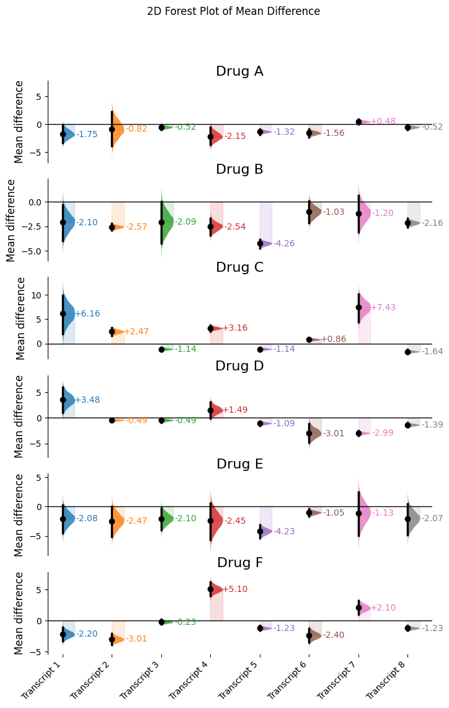
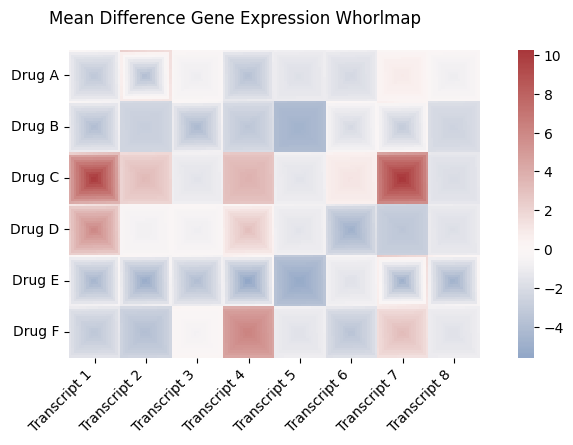
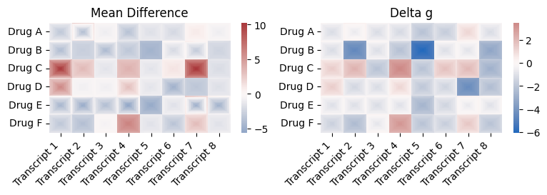
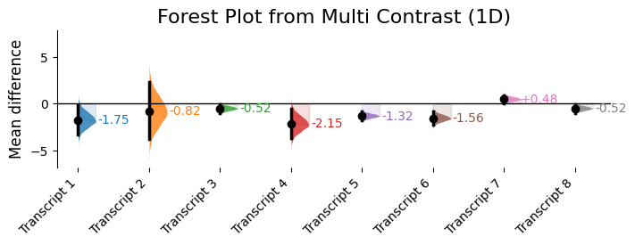
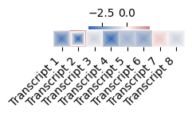
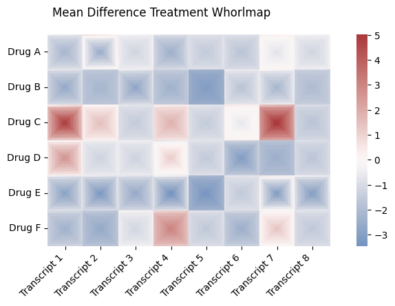
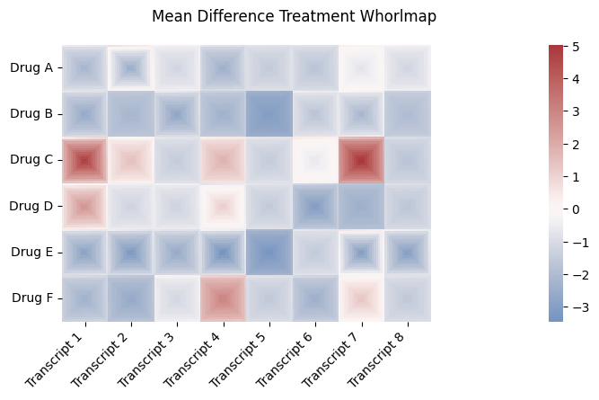
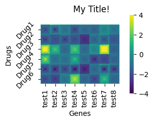

# Whorlmaps: Visualizing Even More Contrasts


<!-- WARNING: THIS FILE WAS AUTOGENERATED! DO NOT EDIT! -->

In DABEST **v2025.10.20**, we introduce a new and more compact way of
visualizing bootstrap distributions: - whorlmap

## Load libraries

``` python
import pandas as pd
import numpy as np
import matplotlib.pyplot as plt
from scipy.stats import norm
import dabest
from dabest.multi import combine, whorlmap
```

    Pre-compiling numba functions for DABEST...

    Compiling numba functions: 100%|██████████| 11/11 [00:00<00:00, 37.69it/s]

    Numba compilation complete!

## Create a simulated dataset and generate a list of corresponding dabest objects

``` python
def create_delta_dataset(N=50, 
                        seed=9999, 
                        second_quarter_adjustment=3, 
                        third_quarter_adjustment= -0.5,
                        fourth_quarter_adjustment= -3, 
                        scale4=1, initial_loc = 10):
    """Create a sample dataset for delta-delta analysis."""
    np.random.seed(seed)

    # Create samples
    y = norm.rvs(loc=initial_loc, scale=0.4, size=N*4)
    y[N:2*N] = norm.rvs(loc=initial_loc + second_quarter_adjustment, scale= 1, size=N) 
    y[2*N:3*N] = norm.rvs(loc=initial_loc + third_quarter_adjustment, scale=0.4, size=N)
    y[3*N:4*N] = norm.rvs(loc=initial_loc + fourth_quarter_adjustment, scale=scale4, size=N)

    # Treatment, Rep, Genotype, and ID columns
    treatment = np.repeat(['Placebo', 'Drug'], N*2).tolist()
    genotype = np.repeat(['W', 'M', 'W', 'M'], N).tolist()
    id_col = list(range(0, N*2)) * 2

    # Combine all columns into a DataFrame
    df = pd.DataFrame({
        'ID': id_col,
        'Genotype': genotype,
        'Treatment': treatment,
        'Transcript Level': y
    })
    return df
```

## Working with many many Dabest objects

Let’s say you have a transcriptomics experiment where you investigate
the effects of administering 6 different drugs on oncogene transcripts 1
to 10. You want to find the drug that reduces all the transcripts the
most effectively. In a 2x2 experiment, drug is compared to its placebo,
so we will be tabulating delta-delta effect sizes. You may simulate the
data as follows:

``` python
dabest_objects_2d = [[None for _ in range(8)] for _ in range(6)]
labels_2d = ["Transcript 1", "Transcript 2", "Transcript 3", "Transcript 4", "Transcript 5", "Transcript 6", "Transcript 7", "Transcript 8"]
row_labels_2d = ["Drug A", "Drug B", "Drug C", "Drug D", "Drug E", "Drug F"]
drug_effect_2d = [[.9, 2, 2, .5, 1.2, 1, 3,2, 3, 4], 
             [0.1, -.3, .1, -0.3, -2, 1.2, 1,.1,-4, 2],
             [4, 4, 1, 5, 1, 3, 6.5,.5, -1.2, .4],
             [6, 2, 2, 4, 1.4, -0.5, -.5,1.1, 3, .4],
             [0.1, -.3, .1, -0.3, -2, 1.2, 1,.1,-4, 2],
             [-.3, -1, 2, 7, 1, -0.5, 4,1, 2.3, -.4],
                                ]
drug_effect_scale_2d = [[5, 10, 1, 5, 1, 2, 1,1, .1, 2], 
             [7, .2, 8, 3, 1, 4, 7,1, 5, 2],
             [15, 3, 1, 2, 1, 1, 11,1, 7, 2],
             [8, .1, 1, 5, 1, 6,1,1, 3, .4],
             [9, 10, 7, 12, 4, 2,14,10, 9, 20],
             [4, 3, 1, 4, 1, 4,4,1, 3, 4],
             ]
seeds = [1, 1000, 20, 9999, 1000, 5320]

for i in range(len(row_labels_2d)):
    for j in range(len(labels_2d)):
        df = create_delta_dataset(seed=seeds[i], 
                                  fourth_quarter_adjustment=drug_effect_2d[i][j],
                                  scale4=drug_effect_scale_2d[i][j],
                                 initial_loc = 20)
        dabest_objects_2d[i][j] = dabest.load(data=df, 
                       x=["Genotype", "Genotype"], 
                       y="Transcript Level", 
                       delta2=True, 
                       experiment="Treatment")
```

We are going to create a new object called MultiContrast which will
contain the array of contrast objects and information about them.

``` python
multi_2d_mean_diff = combine(dabest_objects_2d, labels_2d, row_labels=row_labels_2d, effect_size="mean_diff")
print("multi_2d_mean_diff is a " + str(multi_2d_mean_diff))
```

    multi_2d_mean_diff is a MultiContrast(2D: 6x8, effect_size='mean_diff', contrast_type='delta2')

As we have seen in the previous tutorial, we can visualize these effect
sizes with forest plot as follows:

``` python
multi_2d_mean_diff.forest_plot(forest_plot_title = "2D Forest Plot of Mean Difference", forest_plot_kwargs = { 'marker_size': 6});
```



This data would require a stack of forest plots to visualize. So
instead, we plot a whorlmap for a concise representation and use color
to represent the dimension of effect size. For each effect size, the
full bootstrap distribution is binned by quantiles and ranked by value,
and then each bin is represented by a pixel. All the pixels correponding
to the bins of effects are arranged in a spiral in a cell. The redness
and the blueness of the cells represent the magnitude of the effects in
the positive and negative direction.

``` python
multi_2d_mean_diff.whorlmap(
    title="Mean Difference Gene Expression Whorlmap",
    cmap="vlag",
    chop_tail=2.5,  # Remove 5% extreme values
    fig_size = (10, 4)
);
```



The resulting graphic is easy to interpret. Drug B and E induces the
most broad spectrum reduction. However the data for Drug E seems a
little less precise, mixing blue and red colored pixels. We can say Drug
B is a surer bet.

## Plotting whorlmaps with standardized effect sizes

We can also visualize the same array of effects in terms of standardized
effect delta g. Let’s plot them together in the same figure by
specifying the axes to plot in:

``` python
figure, axes = plt.subplots(1, 2, figsize = (9, 2))
multi_2d_mean_diff.whorlmap(
    cmap="vlag",
    chop_tail=2.5,  # Remove 5% extreme values
    title="Mean Difference", ax = axes[0]
);

multi_2d_delta_g = combine(dabest_objects_2d, labels_2d, row_labels=row_labels_2d, effect_size="delta_g")
print("multi_2d_delta_g is a " + str(multi_2d_delta_g))

multi_2d_delta_g.whorlmap(
    cmap="vlag",
    chop_tail=2.5,  # Remove 5% extreme values
    title="Delta g", ax = axes[1]
);
```

    multi_2d_delta_g is a MultiContrast(2D: 6x8, effect_size='delta_g', contrast_type='delta2')



## MultiContrast object can also handle 1-D dabest object arrays

``` python
multi_1d = combine(dabest_objects_2d[0], labels_2d, row_labels="Drug A", effect_size="mean_diff")
```

You can plot a forest plot from this MultiContrast object

``` python
fig_forest = multi_1d.forest_plot(forest_plot_kwargs = {"title":"Forest Plot from Multi Contrast (1D)", "marker_size": 6})
```



## 1-D whorlmap also works

``` python
multi_1d.whorlmap(
    n=21,  # Larger spiral size
    chop_tail=2.5  # Remove 5% extreme values
)
# plt.title("Customized whorlmap")
plt.show()
```



``` python
dabest_objects_2d_2group_delta = [[None for _ in range(8)] for _ in range(6)]
for i in range(len(row_labels_2d)):
    for j in range(len(labels_2d)):
        df = create_delta_dataset(seed=seeds[i], 
                                  fourth_quarter_adjustment=drug_effect_2d[i][j],
                                  scale4=drug_effect_scale_2d[i][j],
                                 initial_loc = 20)
        dabest_objects_2d_2group_delta[i][j] = dabest.load(data=df, 
                       x="Treatment", 
                       y="Transcript Level", 
                       idx = ("Placebo", "Drug"))
multi_2d_2group_delta_mean_diff = combine(dabest_objects_2d_2group_delta, labels_2d, row_labels=row_labels_2d, effect_size="mean_diff")
print("multi_2d_mean_diff is a " + str(multi_2d_2group_delta_mean_diff))
```

    multi_2d_mean_diff is a MultiContrast(2D: 6x8, effect_size='mean_diff', contrast_type='delta')

``` python
multi_2d_2group_delta_mean_diff.whorlmap(
    title="Mean Difference Treatment Whorlmap",
    cmap="vlag",
    chop_tail=2.5,  # Remove 5% extreme values
    fig_size = (10, 4)
);
```



``` python
multi_2d_2group_delta_mean_diff.whorlmap(
    title="Mean Difference Treatment Whorlmap",
    cmap="vlag",
    chop_tail=2.5,  # Remove 5% extreme values
    fig_size = (10, 4),
    heatmap_kwargs={'cbar_kws':{'pad':0.17}}
);
```



## Heatmap and plot kwargs

You can customize the whorlmap further by passing in `heatmap_kwargs`
and `plot_kwargs`.

``` python
multi_2d_2group_delta_mean_diff.whorlmap(
    heatmap_kwargs={'cbar_kws':{'pad':0.10}, "cmap":'viridis', "vmax":4, "vmin":-4},
    plot_kwargs={'xlabel':"Genes", 'ylabel':"Drugs", 
                 "xticklabels":['test1', 'test2', 'test3', 'test4', 'test5', 'test6', 'test7', 'test8'],
                 "xticklabels_rotation": 90, "xticklabels_ha": 'center',
                 "yticklabels": ['Drug1', 'Drug2', 'Drug3', 'Drug4', 'Drug5', 'Drug6'],
                 "yticklabels_rotation": 45, 'yticklabels_ha': "right", 'title': 'My Title!'}
);
```


