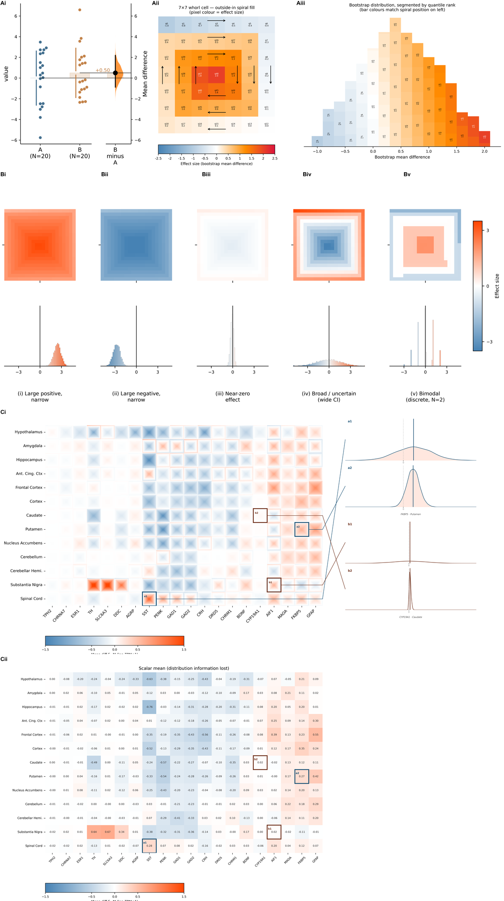

# whorlmap-paper

Analysis and figures for a technical paper documenting the design and application of whorlmap.

Whorlmap is a compact heatmap design for high-dimensional comparisons where each cell encodes a full bootstrap/effect-size distribution as a tiny spiral, rather than collapsing uncertainty into a single color. It lets readers scan many treatment–outcome contrasts at once while still seeing direction, magnitude, and uncertainty inside each cell.



## Reproduce Figure 1

```sh
git clone https://github.com/sangyu/whorlmap-paper
cd whorlmap-paper/nbs
pip install dabest pandas numpy matplotlib seaborn scipy Pillow svgutils lxml nbconvert ipykernel
jupyter notebook figure1.ipynb
```

`figure1.ipynb` loads the committed expression cache (`gtex_data/figure1_expr_cache.pkl.gz`,
514 KB) and runs `dabest.combine()` live — bootstraps, whorlmap, and all panels
are generated fresh. Runtime ~10–15 min.

## Full reproducibility from raw GTEx data

See `helpers/survey.ipynb` for the full download and parse pipeline,
then `helpers/make_cache.ipynb` to rebuild the expression cache from scratch.

## Data

Gene expression data are from GTEx v8:

> GTEx Consortium. The GTEx Consortium atlas of genetic regulatory effects across human tissues. *Science* 369, 1318–1330 (2020). https://doi.org/10.1126/science.aaz1776

## Repository layout

```
nbs/
  figure1.ipynb               main figure notebook
  helpers/
    survey.ipynb              GTEx download & parse pipeline (one-time)
    make_cache.ipynb          rebuild expression cache from gene_expr.pkl
  gtex_data/
    figure1_expr_cache.pkl.gz committed 514 KB expression cache
    sample_meta.csv           sample → region/sex mapping
    survey.csv                bootstrap statistics across all GTEx genes
```
