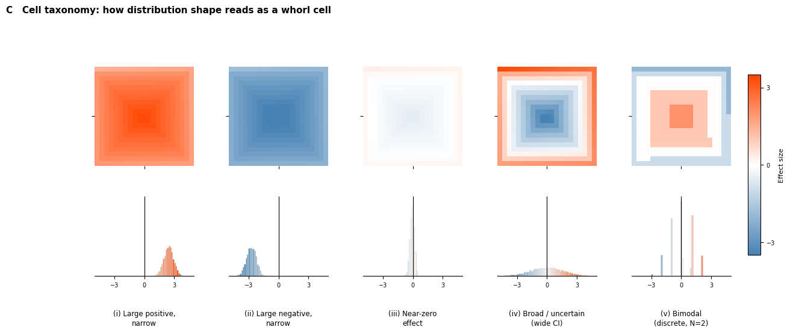
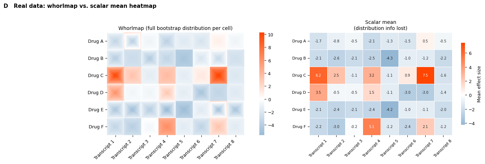
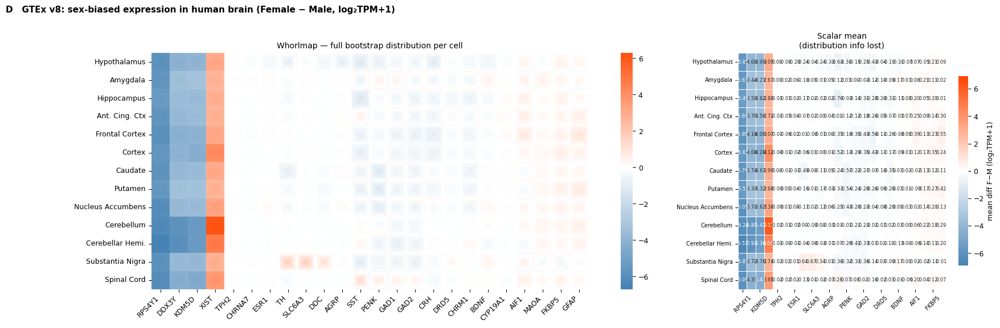

# Whorlmap Algorithm — Explanation Panels


<!-- WARNING: THIS FILE WAS AUTOGENERATED! DO NOT EDIT! -->

## Imports

``` python
import pathlib
import pandas as pd
import numpy as np
import matplotlib.pyplot as plt
from matplotlib.patches import Rectangle
from matplotlib.colors import Normalize, TwoSlopeNorm
from matplotlib.cm import ScalarMappable
from mpl_toolkits.mplot3d.art3d import Poly3DCollection
import seaborn as sns
from scipy.stats import gaussian_kde, norm
import dabest
from dabest.multi import combine, whorlmap

plt.rcParams.update({'font.size': 9, 'axes.titlesize': 10})

IMAGES = pathlib.Path('images')
IMAGES.mkdir(exist_ok=True)
```

## Helper functions

Exact reimplementation of dabest’s internal spiral logic, so each panel
can be built without importing private functions.

``` python
def _spiralize(fill, m, n):
    """Outside-in rectangular spiral: top row right, right col down,
    bottom row left, left col up, then shrinks inward."""
    i = 0; j = 0; k = 0
    array = np.zeros((m, n))
    while m > 0 and k < len(fill):
        jj = j; ii = i
        for j in range(j, n):
            if k >= len(fill): break
            array[i, j] = fill[k]; k += 1
        for i in range(ii + 1, m):
            if k >= len(fill): break
            array[i, j] = fill[k]; k += 1
        for j in range(n - 2, jj - 1, -1):
            if k >= len(fill): break
            array[i, j] = fill[k]; k += 1
        for i in range(m - 2, ii, -1):
            if k >= len(fill): break
            array[i, j] = fill[k]; k += 1
        m -= 1; n -= 1; j += 1
    return array


def make_cell(bootstrap, n=21, chop_tail=2.5, reverse_neg=True):
    """Full pipeline: raw bootstrap array -> n x n spiral cell."""
    bs = sorted(bootstrap)
    chop = int(np.ceil(len(bs) * chop_tail / 100))
    if chop > 0:
        bs = bs[chop:-chop]
    ranks = np.linspace(0, len(bs), n * n, dtype=int)
    ranks[0] = 1
    if sum(v > 0 for v in bs) < len(bs) / 2 and reverse_neg:
        bs = bs[::-1]
    fill = [bs[r - 1] for r in ranks]
    return _spiralize(fill, n, n)

from matplotlib.colors import LinearSegmentedColormap


gradient_colors1 =  ["#05a84c", "#FFFFFF",  "#7e06be"]
gwp = LinearSegmentedColormap.from_list("gwp", gradient_colors1, N=256)
gradient_colors2 =  ["steelblue","white",  "orangered"]
steelwhiteorangered = LinearSegmentedColormap.from_list("steelwhiteorangered", gradient_colors2, N=256)

# Diverging colormap and norm — swap CMAP here to try a different palette
CMAP  = steelwhiteorangered
DNORM = TwoSlopeNorm(vcenter=0, vmin=-3.5, vmax=3.5)
```


## Panel A — From bootstrap distribution to whorl cell

Showing explicitly how quantile rank encodes spatial position.  
**Left**: 7×7 whorl cell coloured by effect size (RdBu_r); each ring is
outlined in a distinct position colour.  
**Right**: Bootstrap distribution as a histogram (bars coloured by
effect size); horizontal brackets — in the same position colours — show
which quantile band maps to which ring.

``` python
matplotlib.use('Agg')
import pathlib, pandas as pd, numpy as np, matplotlib.pyplot as plt
from matplotlib.colors import LinearSegmentedColormap, Normalize
from matplotlib.colorbar import ColorbarBase
import dabest
from dabest.multi import combine

plt.rcParams.update({'font.size': 9, 'axes.titlesize': 10})
IMAGES = pathlib.Path('images')

# steelblue → white (at midpoint 0.5) → orange → crimson
# White MUST be at position 0.5 so Normalize(-bound, bound) places white at value 0
CMAP_SWOR = LinearSegmentedColormap.from_list(
    'steelwhiteorangered',
    [(0.00, (70/255, 130/255, 180/255)),
     (0.50, (1.0,   1.0,   1.0  )),
     (0.75, (1.0,   0.55,  0.0  )),
     (1.00, (0.86,  0.08,  0.24 ))],
    N=256
)

def _spiralize(fill, m, n):
    i=0; j=0; k=0; array=np.zeros((m,n))
    while m>0 and k<len(fill):
        jj=j; ii=i
        for j in range(j,n):
            if k>=len(fill): break
            array[i,j]=fill[k]; k+=1
        for i in range(ii+1,m):
            if k>=len(fill): break
            array[i,j]=fill[k]; k+=1
        for j in range(n-2,jj-1,-1):
            if k>=len(fill): break
            array[i,j]=fill[k]; k+=1
        for i in range(m-2,ii,-1):
            if k>=len(fill): break
            array[i,j]=fill[k]; k+=1
        m-=1; n-=1; j+=1
    return array

def _spiral_path(n):
    path = []
    top, bot, lft, rgt = 0, n-1, 0, n-1
    while top <= bot and lft <= rgt:
        for c in range(lft, rgt+1): path.append((top, c))
        top += 1
        for r in range(top, bot+1): path.append((r, rgt))
        rgt -= 1
        if top <= bot:
            for c in range(rgt, lft-1, -1): path.append((bot, c))
            bot -= 1
        if lft <= rgt:
            for r in range(bot, top-1, -1): path.append((r, lft))
            lft += 1
    return path

def _ring_structure(n):
    rings, pos, k = [], 0, 0
    while True:
        sz = n - 2*k
        if sz <= 0: break
        nc = 1 if sz == 1 else 4*(sz-1)
        rings.append({'k': k, 'start': pos, 'end': pos+nc, 'sz': sz})
        pos += nc; k += 1
        if sz == 1: break
    return rings

# Bootstrap
n = 7; N = n*n
_rng    = np.random.default_rng(42)
noise_a = _rng.normal(0, 3., 20); noise_b = _rng.normal(0, 3., 20)
group_a = noise_a - noise_a.mean(); group_b = noise_b - noise_b.mean() + 0.5
_df_a   = pd.DataFrame({'group': ['A']*20+['B']*20,
                         'value': np.concatenate([group_a, group_b])})
_dobj_a = dabest.load(_df_a, x='group', y='value', idx=('A', 'B'))
_multi_a = combine([[_dobj_a]], ['gene'], row_labels=['region'], effect_size='mean_diff')
bs_raw  = sorted(_multi_a.bootstraps[0])
chop    = int(np.ceil(len(bs_raw)*0.025)); bs_c = bs_raw[chop:-chop]
ranks   = np.linspace(0, len(bs_c), N, dtype=int); ranks[0] = 1
fv      = np.array([bs_c[r-1] for r in ranks])
if sum(v>0 for v in bs_c) < len(bs_c)/2: fv = fv[::-1]

XLIM  = (-3.5, 3.5)
rings = _ring_structure(n)

fv_sorted  = np.clip(np.sort(fv), *XLIM)
cell_vals  = _spiralize(fv.tolist(), n, n)

# Symmetric value-based norm — same for panel AND colorbar so colours match exactly
bound      = max(2.0, np.ceil(max(abs(fv_sorted[0]), abs(fv_sorted[-1])) * 2) / 2)
VALUE_NORM = Normalize(vmin=-bound, vmax=bound)

spiral_pos = _spiral_path(n)

# Figure
fig = plt.figure(figsize=(11, 5.4))
ax_cell = fig.add_axes([0.03, 0.18, 0.32, 0.68])
ax_cbar = fig.add_axes([0.03, 0.08, 0.32, 0.05])
ax_hist = fig.add_axes([0.43, 0.12, 0.54, 0.74])

# Left: whorl cell coloured by effect size value (same norm as colorbar)
ax_cell.imshow(cell_vals, cmap=CMAP_SWOR, norm=VALUE_NORM,
               origin='upper', interpolation='nearest', aspect='equal')

def _ring_arrows(ax, ring_k, sz, avg_val):
    mid = ring_k + sz // 2
    bg  = CMAP_SWOR(VALUE_NORM(avg_val))
    col = 'w' if (0.299*bg[0] + 0.587*bg[1] + 0.114*bg[2]) < 0.52 else 'k'
    ap  = dict(arrowstyle='->', color=col, lw=1.0, mutation_scale=9)
    d   = 0.25  # shift outward from pixel centre by this fraction of a cell
    ax.annotate('', xy=(mid+0.6, ring_k-d),         xytext=(mid-0.6, ring_k-d),         arrowprops=ap, zorder=8, annotation_clip=False)
    ax.annotate('', xy=(ring_k+sz-1+d, mid+0.6),    xytext=(ring_k+sz-1+d, mid-0.6),    arrowprops=ap, zorder=8, annotation_clip=False)
    ax.annotate('', xy=(mid-0.6, ring_k+sz-1+d),    xytext=(mid+0.6, ring_k+sz-1+d),    arrowprops=ap, zorder=8, annotation_clip=False)
    ax.annotate('', xy=(ring_k-d, mid-0.6),             xytext=(ring_k-d, mid+0.6),             arrowprops=ap, zorder=8, annotation_clip=False)

for ring in rings[:-1]:
    avg_val = float(np.mean(fv_sorted[ring['start']:ring['end']]))
    _ring_arrows(ax_cell, ring['k'], ring['sz'], avg_val)

# Annotate every pixel: quantile rank + effect size value (luminance from VALUE_NORM)
for k, (r, c) in enumerate(spiral_pos):
    val = float(fv[k])
    bg  = CMAP_SWOR(VALUE_NORM(val))
    lum = 0.299*bg[0] + 0.587*bg[1] + 0.114*bg[2]
    tc  = 'w' if lum < 0.52 else 'k'
    ax_cell.text(c, r, f'q{k}\n{val:.1f}',
                 ha='center', va='center', fontsize=4.5, color=tc,
                 zorder=10, linespacing=1.1, multialignment='center')

ax_cell.set_xlim(-0.5, n-0.5); ax_cell.set_ylim(n-0.5, -0.5)
ax_cell.axis('off')
ax_cell.set_title('7×7 whorl cell — outside-in spiral fill\n(pixel colour = effect size)', fontsize=9)

# Colorbar: same VALUE_NORM — colours identical between panel and bar
cb = ColorbarBase(ax_cbar, cmap=CMAP_SWOR, norm=VALUE_NORM, orientation='horizontal')
cb_ticks = np.arange(-bound, bound + 0.01, 0.5)
cb.set_ticks(cb_ticks)
cb.set_ticklabels([f'{t:g}' for t in cb_ticks])
cb.ax.tick_params(labelsize=7.5)
cb.set_label('Effect size (bootstrap mean difference)', fontsize=8)

# Right: stacked quantile histogram (value-coloured segments, matching panel + colorbar)
BIN_W = 0.20
bins  = np.arange(XLIM[0], XLIM[1]+BIN_W, BIN_W)
counts, _ = np.histogram(np.clip(bs_c, *XLIM), bins=bins, density=True)

seg_bounds = np.empty(N+1)
seg_bounds[0] = XLIM[0]; seg_bounds[-1] = XLIM[1]
for k in range(1, N):
    seg_bounds[k] = (fv_sorted[k-1] + fv_sorted[k]) / 2.0
seg_cols = [CMAP_SWOR(VALUE_NORM(float(v))) for v in fv_sorted]

best_piece = {}  # k -> (x_center, y_bottom, h)

for lo, hi, ht in zip(bins[:-1], bins[1:], counts):
    if ht == 0: continue
    y_bot = 0.0
    for k in range(N):
        overlap = max(0., min(hi, seg_bounds[k+1]) - max(lo, seg_bounds[k]))
        if overlap <= 0: continue
        h = ht * overlap / (hi - lo)
        ax_hist.bar(lo, h, width=hi-lo, bottom=y_bot,
                    align='edge', color=seg_cols[k], edgecolor='none')
        if k not in best_piece or h > best_piece[k][2]:
            best_piece[k] = (lo + (hi - lo) / 2, y_bot, h)
        y_bot += h

for k, (xc, yb, h) in best_piece.items():
    if h < counts.max() * 0.005: continue
    val = float(fv_sorted[k])
    col = CMAP_SWOR(VALUE_NORM(val))
    lum = 0.299*col[0] + 0.587*col[1] + 0.114*col[2]
    tc  = 'w' if lum < 0.52 else 'k'
    ax_hist.text(xc, yb + h/2, f'q{k}\n{val:.1f}',
                 ha='center', va='center', fontsize=3.5, color=tc,
                 zorder=11, linespacing=1.0, multialignment='center')

margin = (fv_sorted[-1] - fv_sorted[0]) * 0.08
ax_hist.set_xlim(fv_sorted[0] - margin, fv_sorted[-1] + margin)
ax_hist.set_ylim(0, counts.max()*1.03)
ax_hist.spines['left'].set_visible(False)
ax_hist.spines['right'].set_visible(False); ax_hist.spines['top'].set_visible(False)
ax_hist.set_yticks([]); ax_hist.tick_params(labelsize=8)
ax_hist.set_xlabel('Bootstrap mean difference', fontsize=9)
ax_hist.set_title('Bootstrap distribution, segmented by quantile rank\n'
                  '(bar colours match spiral position on left)', fontsize=9)

fig.suptitle('A   From bootstrap distribution to whorl cell: '
             'quantile rank encodes spatial position',
             fontsize=11, fontweight='bold', x=0.02, ha='left', y=0.99)

fig.savefig(IMAGES/'panel_a.svg', bbox_inches='tight')
fig.savefig(IMAGES/'panel_a.png', dpi=600, bbox_inches='tight')
print("Saved panel_a.svg / panel_a.png")
```

## <s>Panel B</s> — retired (merged into Panel A)

``` python
# Panel B retired — content merged into Panel A
```

## Panel C — Cell taxonomy

Five canonical distribution shapes and the whorl cells they produce. All
cells share the same colour scale (vlag, ±3.5).

``` python
def _make_1x1_multi(group_a, group_b):
    """Wrap two sample arrays into a 1x1 MultiContrast for whorlmap."""
    df = pd.DataFrame({
        'group': ['A'] * len(group_a) + ['B'] * len(group_b),
        'value': np.concatenate([group_a, group_b])
    })
    dobj = dabest.load(df, x='group', y='value', idx=('A', 'B'))
    return combine([[dobj]], [''], row_labels=[''], effect_size='mean_diff')


_rng = np.random.default_rng(1234)
_ga1 = _rng.normal(0, 1.5, 22);  _gb1 = _rng.normal( 3.0, 1.5, 22)
_ga2 = _rng.normal(0, 1.5, 22);  _gb2 = _rng.normal(-3.0, 1.5, 22)
_ga3 = _rng.normal(0, 0.4, 5); _gb3 = _rng.normal( 0.05, 0.4, 5)
_ga4 = _rng.normal(0, 0.5,  15); _gb4 = _rng.normal( 0.3,  6.0,  15)
_ga5 = np.array([0, 0, 0, 0, 0,])       # N=2 → 3 discrete bootstrap values: honest representation
_gb5 = np.array([2.1, 2,  2.05,-3,  -3.05  ])

scenarios = [
    ('(i) Large positive,\nnarrow',      _make_1x1_multi(_ga1, _gb1)),
    ('(ii) Large negative,\nnarrow',      _make_1x1_multi(_ga2, _gb2)),
    ('(iii) Near-zero\neffect',           _make_1x1_multi(_ga3, _gb3)),
    ('(iv) Broad / uncertain\n(wide CI)', _make_1x1_multi(_ga4, _gb4)),
    ('(v) Bimodal\n(discrete, N=2)',      _make_1x1_multi(_ga5, _gb5)),
]

# Histogram parameters: fixed bin width = heatmap colour range, shared y-max
XLIM  = (-5, 5)
BIN_W = 0.14
BINS  = np.arange(XLIM[0], XLIM[1] + BIN_W, BIN_W)
BINCX = 0.5 * (BINS[:-1] + BINS[1:])   # bin centres for colouring

hists = []
for _, multi in scenarios:
    bs = np.clip(multi.bootstraps[0], *XLIM)
    counts, _ = np.histogram(bs, bins=BINS, density=True)
    hists.append(counts)
ymax = max(h.max() for h in hists)*1.05

fig, axes = plt.subplots(
    2, 5, figsize=(14, 5),
    gridspec_kw={'hspace': 0.08, 'wspace': 0.35, 'height_ratios': [1.8, 1]}
)

for j, ((label, multi), counts) in enumerate(zip(scenarios, hists)):
    multi.whorlmap(
        n=21, chop_tail=2.5, cmap=CMAP, vmin=-3.5, vmax=3.5,
        ax=axes[0, j],
        heatmap_kwargs={'cbar': False},
        plot_kwargs={'xticklabels': [''], 'yticklabels': ['']},
    )
    axes[0, j].set_aspect('equal')

    ax = axes[1, j]
    cols = CMAP(DNORM(BINCX))
    for lo, hi, ht, c in zip(BINS[:-1], BINS[1:], counts, cols):
        ax.bar(lo, ht, width=hi - lo, align='edge', color=c,
               edgecolor='lightgray', linewidth=.5)
    ax.set_xlim(*XLIM)
    ax.set_ylim(0, ymax)
    ax.spines['left'].set_position('zero')
    ax.spines['right'].set_visible(False)
    ax.spines['top'].set_visible(False)
    ax.set_yticks([])
    ax.set_xticks([-3, 0, 3])
    ax.tick_params(labelsize=7)
    ax.text(0.5, -0.42, label, transform=ax.transAxes,
            ha='center', fontsize=8.5, va='top', linespacing=1.3)

fig.subplots_adjust(right=0.88)
cbar_ax = fig.add_axes([0.90, 0.18, 0.015, 0.60])
sm = ScalarMappable(cmap=CMAP, norm=DNORM)
sm.set_array([])
cbar = fig.colorbar(sm, cax=cbar_ax)
cbar.set_label('Effect size', fontsize=8)
cbar.set_ticks([-3, 0, 3])
cbar.ax.tick_params(labelsize=7)

plt.suptitle(
    'C   Cell taxonomy: how distribution shape reads as a whorl cell',
    fontsize=11, fontweight='bold', x=0.02, ha='left', y=1.01
)
fig.savefig(IMAGES / 'panel_c.svg', bbox_inches='tight')
fig.savefig(IMAGES / 'panel_c.png', dpi=600, bbox_inches='tight')
plt.show()
```

    /Users/sangyuxu/Documents/GitHub/DABEST-python/dabest/_effsize_objects.py:523: UserWarning: The lower limit of the BCa interval of baseline curve cannot be computed. It is set to the effect size itself. All bootstrap values were likely all the same.
      warnings.warn(err_temp.substitute(lim_type="lower"), stacklevel=0)
    /Users/sangyuxu/Documents/GitHub/DABEST-python/dabest/_effsize_objects.py:527: UserWarning: The upper limit of the BCa interval of baseline curve cannot be computed. It is set to the effect size itself. All bootstrap values were likely all the same.
      warnings.warn(err_temp.substitute(lim_type="upper"), stacklevel=0)



``` python
scenarios[4][1].bootstraps
```

    [array([-0.00833333,  0.        , -3.00833333, ..., -2.00833333,
             0.        , -0.99166667])]

## Panel D — Real whorlmap vs. scalar heatmap

Simulated transcriptomics data: 6 drugs × 8 transcripts, delta-delta
design. The whorlmap (left) preserves the full bootstrap distribution
per cell; the scalar mean heatmap (right) collapses each to a single
number.

``` python
def create_delta_dataset(
    N=50, seed=9999,
    second_quarter_adjustment=3,
    third_quarter_adjustment=-0.5,
    fourth_quarter_adjustment=-3,
    scale4=1, initial_loc=10
):
    np.random.seed(seed)
    y = norm.rvs(loc=initial_loc, scale=0.4, size=N * 4)
    y[N:2*N]   = norm.rvs(loc=initial_loc + second_quarter_adjustment, scale=1,      size=N)
    y[2*N:3*N] = norm.rvs(loc=initial_loc + third_quarter_adjustment,  scale=0.4,    size=N)
    y[3*N:4*N] = norm.rvs(loc=initial_loc + fourth_quarter_adjustment, scale=scale4, size=N)
    return pd.DataFrame({
        'ID':               list(range(N * 2)) * 2,
        'Genotype':         np.repeat(['W', 'M', 'W', 'M'], N).tolist(),
        'Treatment':        np.repeat(['Placebo', 'Drug'], N * 2).tolist(),
        'Transcript Level': y,
    })


labels_2d     = [f'Transcript {i}' for i in range(1, 9)]
row_labels_2d = ['Drug A', 'Drug B', 'Drug C', 'Drug D', 'Drug E', 'Drug F']

drug_effect = [
    [ .9,  2.0,  2.0,  .5,  1.2,  1.0,  3.0, 2.0],
    [ .1,  -.3,   .1, -.3, -2.0,  1.2,  1.0,  .1],
    [4.0,  4.0,  1.0, 5.0,  1.0,  3.0,  6.5,  .5],
    [6.0,  2.0,  2.0, 4.0,  1.4,  -.5,  -.5, 1.1],
    [ .1,  -.3,   .1, -.3, -2.0,  1.2,  1.0,  .1],
    [-.3, -1.0,  2.0, 7.0,  1.0,  -.5,  4.0, 1.0],
]
drug_scale = [
    [ 5, 10,  1,  5,  1,  2,  1, 1],
    [ 7,  .2, 8,  3,  1,  4,  7, 1],
    [15,  3,  1,  2,  1,  1, 11, 1],
    [ 8,  .1, 1,  5,  1,  6,  1, 1],
    [ 9, 10,  7, 12,  4,  2, 14, 10],
    [ 4,  3,  1,  4,  1,  4,  4,  1],
]
seeds = [1, 1000, 20, 9999, 1000, 5320]

dabest_objects_2d = [[None] * 8 for _ in range(6)]
for i in range(6):
    for j in range(8):
        df = create_delta_dataset(
            seed=seeds[i],
            fourth_quarter_adjustment=drug_effect[i][j],
            scale4=drug_scale[i][j],
            initial_loc=20
        )
        dabest_objects_2d[i][j] = dabest.load(
            data=df,
            x=['Genotype', 'Genotype'],
            y='Transcript Level',
            delta2=True,
            experiment='Treatment'
        )

multi_2d = combine(dabest_objects_2d, labels_2d,
                   row_labels=row_labels_2d, effect_size='mean_diff')
print(multi_2d)
```

    MultiContrast(2D: 6x8, effect_size='mean_diff', contrast_type='delta2')

``` python
fig, (ax_whorl, ax_scalar) = plt.subplots(
    1, 2, figsize=(14, 4.5),
    gridspec_kw={'width_ratios': [3, 1.8]}
)

_, mean_df = multi_2d.whorlmap(
    cmap=CMAP, chop_tail=2.5,
    title='Whorlmap (full bootstrap distribution per cell)',
    ax=ax_whorl
)
ax_whorl.set_aspect('equal')

sns.heatmap(
    mean_df, ax=ax_scalar,
    cmap=CMAP, center=0,
    annot=True, fmt='.1f',
    linewidths=0.5, linecolor='white',
    annot_kws={'fontsize': 7},
    cbar_kws={'label': 'Mean effect size', 'shrink': 0.8}
)
ax_scalar.set_title('Scalar mean\n(distribution info lost)', fontsize=10)
ax_scalar.tick_params(axis='x', rotation=45, labelsize=8)
ax_scalar.tick_params(axis='y', rotation=0,  labelsize=8)

plt.suptitle(
    'D   Real data: whorlmap vs. scalar mean heatmap',
    fontsize=11, fontweight='bold', x=0.02, ha='left', y=1.01
)
plt.tight_layout()
fig.savefig(IMAGES / 'panel_d_sim.svg', bbox_inches='tight')
fig.savefig(IMAGES / 'panel_d_sim.png', dpi=600, bbox_inches='tight')
plt.show()
```



## Panel D — GTEx real data: sex-biased gene expression across human brain regions

Female − Male mean difference (log₂TPM+1), 13 brain regions × selected
genes.  
Left columns: sex-chromosome and hormone-receptor anchors (large known
effects).  
Right columns: 20 genes sampled for distribution-shape variety.

``` python
import os, gzip, pathlib, urllib.request
import numpy as np
import pandas as pd
from scipy.stats import skew, kurtosis

# ── Paths ──────────────────────────────────────────────────────────────────────
DATA_DIR = pathlib.Path("gtex_data")
DATA_DIR.mkdir(exist_ok=True)

TPM_GZ    = DATA_DIR / "GTEx_gene_tpm.gct.gz"
ATTR_FILE = DATA_DIR / "GTEx_SampleAttributes.txt"
PHENO_FILE= DATA_DIR / "GTEx_SubjectPhenotypes.txt"

GTEX_BASE      = "https://storage.googleapis.com/adult-gtex"
GTEX_TPM_URL   = (f"{GTEX_BASE}/bulk-gex/v8/rna-seq/"
                   "GTEx_Analysis_2017-06-05_v8_RNASeQCv1.1.9_gene_tpm.gct.gz")
GTEX_ATTR_URL  = (f"{GTEX_BASE}/annotations/v8/metadata-files/"
                   "GTEx_Analysis_v8_Annotations_SampleAttributesDS.txt")
GTEX_PHENO_URL = (f"{GTEX_BASE}/annotations/v8/metadata-files/"
                   "GTEx_Analysis_v8_Annotations_SubjectPhenotypesDS.txt")

# ── Brain regions ──────────────────────────────────────────────────────────────
BRAIN_REGIONS = {
    "Hypothalamus":      "Brain - Hypothalamus",
    "Amygdala":          "Brain - Amygdala",
    "Hippocampus":       "Brain - Hippocampus",
    "Ant. Cing. Ctx":    "Brain - Anterior cingulate cortex (BA24)",
    "Frontal Cortex":    "Brain - Frontal Cortex (BA9)",
    "Cortex":            "Brain - Cortex",
    "Caudate":           "Brain - Caudate (basal ganglia)",
    "Putamen":           "Brain - Putamen (basal ganglia)",
    "Nucleus Accumbens": "Brain - Nucleus accumbens (basal ganglia)",
    "Cerebellum":        "Brain - Cerebellum",
    "Cerebellar Hemi.":  "Brain - Cerebellar Hemisphere",
    "Substantia Nigra":  "Brain - Substantia nigra",
    "Spinal Cord":       "Brain - Spinal cord (cervical c-1)",
}

# ── Candidate genes for survey (~150) ──────────────────────────────────────────
CANDIDATE_GENES = [
    # Sex-chromosome anchors
    "XIST", "RPS4Y1", "DDX3Y", "KDM5D", "USP9Y", "EIF1AY", "KDM6A", "KDM5C", "MECP2",
    # Hormone receptors
    "ESR1", "ESR2", "AR", "PGR", "CYP19A1", "NR3C1", "NR3C2", "FKBP5",
    # Dopamine
    "DRD1", "DRD2", "DRD3", "DRD4", "DRD5", "SLC6A3", "TH", "DDC", "COMT", "MAOB",
    # Serotonin
    "HTR1A", "HTR1B", "HTR2A", "HTR2B", "HTR2C", "HTR3A", "SLC6A4", "TPH2", "MAOA",
    # GABA
    "GABRA1", "GABRA2", "GABRA3", "GABRA4", "GABRA5",
    "GABRB1", "GABRB2", "GABRB3", "GABRG2", "GAD1", "GAD2",
    # Glutamate
    "GRIA1", "GRIA2", "GRIA3", "GRIN1", "GRIN2A", "GRIN2B", "GRM1", "GRM5",
    # Acetylcholine
    "CHRM1", "CHRM2", "CHRNA4", "CHRNA7",
    # Norepinephrine
    "ADRA1A", "ADRA2A", "SLC6A2",
    # Opioid
    "OPRM1", "OPRD1", "OPRK1", "PENK", "PDYN",
    # Cannabinoid
    "CNR1",
    # Neuropeptides
    "NPY", "VIP", "SST", "CRH", "CRHR1", "CRHR2", "NTS", "CARTPT", "POMC", "AGRP",
    "OXTR", "AVPR1A", "AVPR1B", "KISS1", "KISS1R",
    # Neurotrophins
    "BDNF", "NTRK2", "NGF", "NTF3",
    # Synaptic
    "NRXN1", "NRXN2", "NRXN3", "NLGN1", "NLGN3", "SHANK2", "SHANK3",
    "SYP", "SYN1", "SNAP25",
    # Glia / myelin
    "MBP", "PLP1", "GFAP", "AIF1", "S100B", "MOG",
    # Inflammation
    "IL6", "TNF", "IL1B", "TGFB1",
    # Clock genes
    "CLOCK", "ARNTL", "PER1", "PER2", "CRY1", "CRY2",
    # Neurodegeneration
    "APP", "MAPT", "SNCA", "LRRK2", "APOE", "CLU",
    # Misc / X-linked
    "FMR1", "PTEN",
    # Housekeeping (expect neutral)
    "ACTB", "GAPDH", "RPL19", "UBB", "HPRT1", "B2M",
]

print(f"Brain regions : {len(BRAIN_REGIONS)}")
print(f"Candidate genes: {len(CANDIDATE_GENES)}")
```

    Brain regions : 13
    Candidate genes: 127

``` python
def _download(url, dest, label):
    if dest.exists():
        print(f"  cached  {dest}")
        return
    print(f"  downloading {label} ...", end=" ", flush=True)
    urllib.request.urlretrieve(url, dest)
    size_mb = dest.stat().st_size / 1e6
    print(f"done  ({size_mb:.0f} MB)")

_download(GTEX_PHENO_URL, PHENO_FILE, "subject phenotypes")
_download(GTEX_ATTR_URL,  ATTR_FILE,  "sample attributes")
_download(GTEX_TPM_URL,   TPM_GZ,     "gene TPM matrix (~2 GB — takes several minutes)")
```

      cached  gtex_data/GTEx_SubjectPhenotypes.txt
      cached  gtex_data/GTEx_SampleAttributes.txt
      cached  gtex_data/GTEx_gene_tpm.gct.gz

``` python
# Build sample → (region_label, sex) lookup
pheno = pd.read_csv(PHENO_FILE, sep="\t")
sex_map = pheno.set_index("SUBJID")["SEX"].map({1: "Male", 2: "Female"})  # 1=M 2=F

attr = pd.read_csv(ATTR_FILE, sep="\t", usecols=["SAMPID", "SMTSD"])
attr["SUBJID"] = attr["SAMPID"].str.extract(r"(GTEX-[^-]+)")
attr["SEX"]    = attr["SUBJID"].map(sex_map)

target_tissues = set(BRAIN_REGIONS.values())
brain_attr = attr[attr["SMTSD"].isin(target_tissues) & attr["SEX"].notna()].copy()

# reverse lookup: GTEx tissue string → short label
region_rev = {v: k for k, v in BRAIN_REGIONS.items()}
brain_attr["region"] = brain_attr["SMTSD"].map(region_rev)

# final mapping: sample_id → (region, sex)
sample_meta = brain_attr.set_index("SAMPID")[["region", "SEX"]].rename(columns={"SEX": "sex"})

print("Brain samples per region:")
print(sample_meta.groupby(["region", "sex"]).size().unstack(fill_value=0).to_string())
print(f"\nTotal brain samples: {len(sample_meta)}")
```

    Brain samples per region:
    sex                Female  Male
    region                         
    Amygdala               55   122
    Ant. Cing. Ctx         62   151
    Caudate                83   208
    Cerebellar Hemi.       74   189
    Cerebellum             92   206
    Cortex                 99   226
    Frontal Cortex        111   314
    Hippocampus            70   173
    Hypothalamus           67   169
    Nucleus Accumbens      77   200
    Putamen                60   172
    Spinal Cord            71   111
    Substantia Nigra       48   116

    Total brain samples: 3326

``` python
# Stream TPM file — extract only candidate genes for brain samples
# Output: gene_expr[gene][sample_id] = log2(TPM+1)

target_genes = set(CANDIDATE_GENES)
brain_samples = set(sample_meta.index)

gene_expr = {}   # {gene_name: {sample_id: float}}

print("Streaming TPM file ...", flush=True)
with gzip.open(TPM_GZ, "rt") as fh:
    fh.readline()           # #1.2
    fh.readline()           # nrow / ncol counts
    header = fh.readline().rstrip().split("\t")
    all_samples = header[2:]  # columns 0=ENSEMBL 1=gene_name 2..=samples

    # column indices for brain samples (offset by 2 for Name/Description cols)
    brain_col_idx = [i for i, s in enumerate(all_samples) if s in brain_samples]
    brain_col_names = [all_samples[i] for i in brain_col_idx]

    found = 0
    for line in fh:
        parts = line.rstrip().split("\t")
        gene = parts[1]
        if gene not in target_genes:
            continue
        tpm = np.array([float(parts[2 + i]) for i in brain_col_idx])
        gene_expr[gene] = dict(zip(brain_col_names, np.log2(tpm + 1)))
        found += 1
        print(f"  found {found}/{len(target_genes)}: {gene}", end="\r", flush=True)
        if found == len(target_genes):
            break

print(f"\nDone. Found {len(gene_expr)}/{len(target_genes)} genes.")
missing = target_genes - set(gene_expr)
if missing:
    print(f"Not in GTEx: {sorted(missing)}")
```

    Streaming TPM file ...
      found 127/127: EIF1AY
    Done. Found 127/127 genes.

``` python
# Bootstrap survey: for each (gene × region), compute F−M mean diff distribution
# Uses 2000 resamples for speed; final figure will use DABEST (5000)

RNG    = np.random.default_rng(42)
N_BOOT = 2000

def _bootstrap_mean_diff(f_vals, m_vals, n_boot=N_BOOT, rng=RNG):
    """Bootstrap distribution of mean(Female) − mean(Male)."""
    f, m = np.asarray(f_vals), np.asarray(m_vals)
    boots = (rng.choice(f, (n_boot, len(f)), replace=True).mean(axis=1)
           - rng.choice(m, (n_boot, len(m)), replace=True).mean(axis=1))
    return boots

def _bimodality_coef(x):
    """Sarle's bimodality coefficient. >0.555 suggests bimodality."""
    n  = len(x)
    g  = skew(x)
    k  = kurtosis(x, fisher=True)   # excess kurtosis
    bc = (g**2 + 1) / (k + 3 * (n - 1)**2 / ((n - 2) * (n - 3)))
    return bc

rows = []
# Store full bootstrap arrays for later use in final figure
boot_arrays = {}   # {(gene, region): array shape (N_BOOT,)}

for gene in CANDIDATE_GENES:
    if gene not in gene_expr:
        continue
    gd = gene_expr[gene]
    for region in BRAIN_REGIONS:
        mask = sample_meta["region"] == region
        sids = sample_meta.index[mask]
        f_sids = sids[sample_meta.loc[sids, "sex"] == "Female"]
        m_sids = sids[sample_meta.loc[sids, "sex"] == "Male"]
        f_vals = [gd[s] for s in f_sids if s in gd]
        m_vals = [gd[s] for s in m_sids if s in gd]
        if len(f_vals) < 5 or len(m_vals) < 5:
            continue
        boots = _bootstrap_mean_diff(f_vals, m_vals)
        boot_arrays[(gene, region)] = boots
        ci_lo, ci_hi = np.percentile(boots, [2.5, 97.5])
        rows.append({
            "gene":       gene,
            "region":     region,
            "n_female":   len(f_vals),
            "n_male":     len(m_vals),
            "mean_md":    boots.mean(),
            "ci_lo":      ci_lo,
            "ci_hi":      ci_hi,
            "ci_width":   ci_hi - ci_lo,
            "bimod_coef": _bimodality_coef(boots),
            "skewness":   float(skew(boots)),
            "ci_crosses_zero": int(ci_lo < 0 < ci_hi),
        })

survey = pd.DataFrame(rows)
print(f"Survey complete: {len(survey)} (gene × region) pairs")
survey.head()
```

    Survey complete: 1651 (gene × region) pairs

<div>
<style scoped>
    .dataframe tbody tr th:only-of-type {
        vertical-align: middle;
    }
&#10;    .dataframe tbody tr th {
        vertical-align: top;
    }
&#10;    .dataframe thead th {
        text-align: right;
    }
</style>

<table class="dataframe" data-quarto-postprocess="true" data-border="1">
<thead>
<tr style="text-align: right;">
<th data-quarto-table-cell-role="th"></th>
<th data-quarto-table-cell-role="th">gene</th>
<th data-quarto-table-cell-role="th">region</th>
<th data-quarto-table-cell-role="th">n_female</th>
<th data-quarto-table-cell-role="th">n_male</th>
<th data-quarto-table-cell-role="th">mean_md</th>
<th data-quarto-table-cell-role="th">ci_lo</th>
<th data-quarto-table-cell-role="th">ci_hi</th>
<th data-quarto-table-cell-role="th">ci_width</th>
<th data-quarto-table-cell-role="th">bimod_coef</th>
<th data-quarto-table-cell-role="th">skewness</th>
<th data-quarto-table-cell-role="th">ci_crosses_zero</th>
</tr>
</thead>
<tbody>
<tr>
<td data-quarto-table-cell-role="th">0</td>
<td>XIST</td>
<td>Hypothalamus</td>
<td>55</td>
<td>147</td>
<td>3.093780</td>
<td>2.825190</td>
<td>3.368355</td>
<td>0.543165</td>
<td>0.331722</td>
<td>0.028471</td>
<td>0</td>
</tr>
<tr>
<td data-quarto-table-cell-role="th">1</td>
<td>XIST</td>
<td>Amygdala</td>
<td>45</td>
<td>107</td>
<td>2.680510</td>
<td>2.411403</td>
<td>2.935903</td>
<td>0.524500</td>
<td>0.344967</td>
<td>-0.114203</td>
<td>0</td>
</tr>
<tr>
<td data-quarto-table-cell-role="th">2</td>
<td>XIST</td>
<td>Hippocampus</td>
<td>54</td>
<td>143</td>
<td>2.794782</td>
<td>2.533156</td>
<td>3.053580</td>
<td>0.520424</td>
<td>0.313016</td>
<td>-0.102577</td>
<td>0</td>
</tr>
<tr>
<td data-quarto-table-cell-role="th">3</td>
<td>XIST</td>
<td>Ant. Cing. Ctx</td>
<td>48</td>
<td>128</td>
<td>2.711460</td>
<td>2.448480</td>
<td>2.974649</td>
<td>0.526169</td>
<td>0.350348</td>
<td>0.043720</td>
<td>0</td>
</tr>
<tr>
<td data-quarto-table-cell-role="th">4</td>
<td>XIST</td>
<td>Frontal Cortex</td>
<td>56</td>
<td>153</td>
<td>3.070690</td>
<td>2.824714</td>
<td>3.319720</td>
<td>0.495006</td>
<td>0.329260</td>
<td>-0.019574</td>
<td>0</td>
</tr>
</tbody>
</table>

</div>

``` python
# Survey summary: aggregate per gene across regions
# Shows which genes are good candidates for each distribution-shape category

gene_summary = (
    survey.groupby("gene")
    .agg(
        mean_effect   = ("mean_md",   "mean"),
        abs_effect    = ("mean_md",   lambda x: x.abs().mean()),
        max_ci_width  = ("ci_width",  "max"),
        mean_ci_width = ("ci_width",  "mean"),
        max_bimod     = ("bimod_coef","max"),
        mean_bimod    = ("bimod_coef","mean"),
        n_crosses_zero= ("ci_crosses_zero", "sum"),
        max_skewness  = ("skewness",  lambda x: x.abs().max()),
    )
    .sort_values("mean_effect")
    .round(3)
)

print("── Strongly negative F−M (good left-column M>>F controls) ──")
print(gene_summary[gene_summary["mean_effect"] < -1].to_string())
print("\n── Strongly positive F−M (good left-column F>>M controls) ──")
print(gene_summary[gene_summary["mean_effect"] > 1].to_string())
print("\n── Wide CI, near-zero mean (neutral + uncertain) ──")
print(gene_summary[
    (gene_summary["mean_effect"].abs() < 0.3) &
    (gene_summary["max_ci_width"] > 0.8)
].sort_values("max_ci_width", ascending=False).to_string())
print("\n── CI crosses zero in most regions (positive mean, negative tail or vice versa) ──")
print(gene_summary[gene_summary["n_crosses_zero"] >= 8].sort_values("mean_effect").to_string())
print("\n── Highest bimodality coefficient ──")
print(gene_summary.sort_values("max_bimod", ascending=False).head(20).to_string())
```

    ── Strongly negative F−M (good left-column M>>F controls) ──
            mean_effect  abs_effect  max_ci_width  mean_ci_width  max_bimod  mean_bimod  n_crosses_zero  max_skewness
    gene                                                                                                             
    RPS4Y1       -5.852       5.852         0.292          0.227      0.371       0.340               0         0.436
    DDX3Y        -4.125       4.125         0.275          0.225      0.356       0.336               0         0.144
    KDM5D        -4.028       4.028         0.326          0.240      0.364       0.334               0         0.295
    EIF1AY       -2.921       2.921         0.255          0.171      0.352       0.333               0         0.134
    USP9Y        -2.886       2.886         0.247          0.199      0.355       0.337               0         0.127

    ── Strongly positive F−M (good left-column F>>M controls) ──
          mean_effect  abs_effect  max_ci_width  mean_ci_width  max_bimod  mean_bimod  n_crosses_zero  max_skewness
    gene                                                                                                           
    XIST        3.429       3.429         0.638          0.519       0.35       0.333               0         0.138

    ── Wide CI, near-zero mean (neutral + uncertain) ──
            mean_effect  abs_effect  max_ci_width  mean_ci_width  max_bimod  mean_bimod  n_crosses_zero  max_skewness
    gene                                                                                                             
    TH           -0.067       0.171         2.127          0.591      0.379       0.345              12         0.485
    SLC6A3        0.061       0.068         2.109          0.282      0.486       0.354              13         0.881
    SST          -0.243       0.306         1.927          1.077      0.368       0.339              10         0.572
    PENK         -0.219       0.237         1.561          0.884      0.352       0.335              12         0.274
    CARTPT       -0.178       0.189         1.556          0.763      0.392       0.337              12         0.450
    SNAP25       -0.182       0.202         1.484          0.938      0.346       0.332              12         0.124
    CRH          -0.209       0.214         1.468          0.630      0.450       0.340              10         0.707
    DDC          -0.028       0.084         1.464          0.285      0.367       0.339              13         0.166
    DRD2         -0.059       0.131         1.359          0.523      0.345       0.327              13         0.157
    NPY          -0.133       0.220         1.348          0.825      0.367       0.335              11         0.429
    NTS          -0.028       0.140         1.345          0.699      0.349       0.333              12         0.371
    AGRP         -0.017       0.056         1.252          0.274      0.370       0.341              13         0.427
    SYP          -0.186       0.206         1.231          0.831      0.354       0.335              12         0.154
    PDYN         -0.043       0.146         1.229          0.781      0.364       0.336              13         0.325
    GRIN1        -0.116       0.162         1.209          0.743      0.358       0.335              13         0.157
    HTR2C        -0.089       0.122         1.152          0.631      0.365       0.340              13         0.130
    SYN1         -0.127       0.160         1.143          0.739      0.360       0.339              12         0.203
    GAD2         -0.248       0.251         1.107          0.875      0.348       0.329              11         0.158
    POMC         -0.268       0.268         1.103          0.517      0.356       0.329               7         0.269
    AIF1          0.100       0.115         1.075          0.797      0.356       0.335              13         0.095
    CNR1         -0.101       0.128         1.070          0.718      0.340       0.330              13         0.164
    GAD1         -0.194       0.208         1.055          0.847      0.355       0.340              12         0.184
    GABRA5       -0.129       0.149         1.055          0.703      0.436       0.342              12         0.800
    GABRA1       -0.149       0.160         1.047          0.742      0.356       0.339              13         0.149
    DRD1         -0.095       0.097         1.046          0.509      0.354       0.328              13         0.382
    PLP1         -0.103       0.147         1.018          0.683      0.353       0.331              13         0.234
    MBP          -0.085       0.148         1.002          0.651      0.350       0.333              13         0.262
    IL6           0.160       0.161         0.972          0.694      0.345       0.331              13         0.241
    NTRK2         0.015       0.073         0.949          0.536      0.345       0.333              13         0.113
    OXTR         -0.076       0.094         0.943          0.508      0.360       0.337              13         0.170
    CHRNA4       -0.019       0.095         0.942          0.434      0.363       0.335              13         0.193
    MOG          -0.078       0.143         0.940          0.721      0.355       0.338              13         0.100
    HPRT1        -0.105       0.138         0.938          0.685      0.346       0.331              13         0.211
    CHRM1        -0.134       0.159         0.924          0.587      0.431       0.346              13         0.960
    IL1B          0.106       0.123         0.920          0.669      0.361       0.337              13         0.191
    SNCA         -0.073       0.127         0.910          0.645      0.354       0.335              12         0.143
    GABRB2       -0.113       0.130         0.909          0.717      0.350       0.333              12         0.161
    GRIA1        -0.064       0.147         0.886          0.726      0.356       0.336              12         0.202
    VIP          -0.125       0.146         0.884          0.605      0.365       0.337              12         0.191
    GABRG2       -0.094       0.119         0.881          0.690      0.359       0.336              13         0.162
    KISS1        -0.090       0.095         0.878          0.337      0.406       0.346              12         0.676
    GFAP          0.185       0.187         0.853          0.634      0.352       0.336              11         0.142
    GABRB3       -0.113       0.136         0.841          0.625      0.359       0.340              12         0.156
    NRXN3        -0.091       0.124         0.819          0.550      0.356       0.339              12         0.143
    FKBP5         0.164       0.181         0.810          0.641      0.345       0.332              12         0.104

    ── CI crosses zero in most regions (positive mean, negative tail or vice versa) ──
             mean_effect  abs_effect  max_ci_width  mean_ci_width  max_bimod  mean_bimod  n_crosses_zero  max_skewness
    gene                                                                                                              
    GAD2          -0.248       0.251         1.107          0.875      0.348       0.329              11         0.158
    SST           -0.243       0.306         1.927          1.077      0.368       0.339              10         0.572
    PENK          -0.219       0.237         1.561          0.884      0.352       0.335              12         0.274
    CRH           -0.209       0.214         1.468          0.630      0.450       0.340              10         0.707
    GAD1          -0.194       0.208         1.055          0.847      0.355       0.340              12         0.184
    SYP           -0.186       0.206         1.231          0.831      0.354       0.335              12         0.154
    SNAP25        -0.182       0.202         1.484          0.938      0.346       0.332              12         0.124
    CARTPT        -0.178       0.189         1.556          0.763      0.392       0.337              12         0.450
    GABRA1        -0.149       0.160         1.047          0.742      0.356       0.339              13         0.149
    CHRM1         -0.134       0.159         0.924          0.587      0.431       0.346              13         0.960
    NPY           -0.133       0.220         1.348          0.825      0.367       0.335              11         0.429
    GABRA5        -0.129       0.149         1.055          0.703      0.436       0.342              12         0.800
    SYN1          -0.127       0.160         1.143          0.739      0.360       0.339              12         0.203
    VIP           -0.125       0.146         0.884          0.605      0.365       0.337              12         0.191
    SHANK3        -0.121       0.127         0.602          0.451      0.352       0.334              10         0.149
    NRXN2         -0.116       0.124         0.696          0.495      0.357       0.335              11         0.199
    GRIN1         -0.116       0.162         1.209          0.743      0.358       0.335              13         0.157
    GABRB3        -0.113       0.136         0.841          0.625      0.359       0.340              12         0.156
    GABRB2        -0.113       0.130         0.909          0.717      0.350       0.333              12         0.161
    GRIN2A        -0.112       0.121         0.789          0.529      0.352       0.337              13         0.108
    ADRA2A        -0.108       0.113         0.630          0.425      0.362       0.341              12         0.273
    HPRT1         -0.105       0.138         0.938          0.685      0.346       0.331              13         0.211
    PLP1          -0.103       0.147         1.018          0.683      0.353       0.331              13         0.234
    CNR1          -0.101       0.128         1.070          0.718      0.340       0.330              13         0.164
    DRD1          -0.095       0.097         1.046          0.509      0.354       0.328              13         0.382
    GABRG2        -0.094       0.119         0.881          0.690      0.359       0.336              13         0.162
    GRIA3         -0.093       0.115         0.783          0.588      0.363       0.341              13         0.200
    NRXN3         -0.091       0.124         0.819          0.550      0.356       0.339              12         0.143
    KISS1         -0.090       0.095         0.878          0.337      0.406       0.346              12         0.676
    GABRA3        -0.090       0.122         0.790          0.590      0.357       0.336              13         0.182
    HTR2C         -0.089       0.122         1.152          0.631      0.365       0.340              13         0.130
    GRIN2B        -0.088       0.119         0.703          0.499      0.355       0.341              12         0.196
    CRHR1         -0.087       0.107         0.624          0.465      0.355       0.334              13         0.175
    GAPDH         -0.085       0.091         0.552          0.428      0.365       0.335              12         0.196
    MBP           -0.085       0.148         1.002          0.651      0.350       0.333              13         0.262
    S100B         -0.081       0.104         0.541          0.435      0.353       0.336              11         0.291
    MAPT          -0.080       0.092         0.674          0.509      0.365       0.342              13         0.165
    MOG           -0.078       0.143         0.940          0.721      0.355       0.338              13         0.100
    OXTR          -0.076       0.094         0.943          0.508      0.360       0.337              13         0.170
    SNCA          -0.073       0.127         0.910          0.645      0.354       0.335              12         0.143
    CRY2          -0.073       0.083         0.626          0.459      0.351       0.336              12         0.125
    APP           -0.068       0.092         0.698          0.527      0.346       0.333              13         0.101
    TH            -0.067       0.171         2.127          0.591      0.379       0.345              12         0.485
    HTR1A         -0.064       0.064         0.697          0.331      0.352       0.337              13         0.250
    GRIA1         -0.064       0.147         0.886          0.726      0.356       0.336              12         0.202
    DRD5          -0.063       0.073         0.651          0.411      0.470       0.351              13         0.880
    HTR3A         -0.059       0.084         0.544          0.263      0.421       0.342              12         0.805
    DRD2          -0.059       0.131         1.359          0.523      0.345       0.327              13         0.157
    NLGN3         -0.052       0.065         0.559          0.396      0.352       0.332              13         0.149
    GRM1          -0.051       0.085         0.736          0.514      0.365       0.337              13         0.197
    DRD4          -0.049       0.063         0.445          0.352      0.348       0.334              13         0.231
    OPRD1         -0.046       0.071         0.478          0.313      0.395       0.341              12         0.692
    NRXN1         -0.045       0.075         0.603          0.476      0.357       0.333              13         0.210
    PDYN          -0.043       0.146         1.229          0.781      0.364       0.336              13         0.325
    UBB           -0.041       0.063         0.573          0.437      0.359       0.331              13         0.228
    APOE          -0.040       0.092         0.766          0.525      0.361       0.334              13         0.137
    SHANK2        -0.040       0.090         0.634          0.511      0.349       0.333              13         0.131
    MECP2         -0.040       0.058         0.478          0.398      0.357       0.334              13         0.159
    PER2          -0.040       0.047         0.437          0.373      0.355       0.332              13         0.163
    GRIA2         -0.039       0.085         0.732          0.577      0.351       0.336              13         0.155
    ACTB          -0.034       0.072         0.574          0.446      0.354       0.330              12         0.100
    GRM5          -0.032       0.075         0.602          0.403      0.355       0.339              13         0.205
    HTR2A         -0.031       0.088         0.794          0.484      0.385       0.339              13         0.540
    NLGN1         -0.030       0.049         0.397          0.318      0.360       0.339              13         0.103
    NTS           -0.028       0.140         1.345          0.699      0.349       0.333              12         0.371
    CLOCK         -0.028       0.049         0.411          0.347      0.355       0.338              12         0.128
    DRD3          -0.028       0.038         0.673          0.170      0.498       0.347              13         0.815
    DDC           -0.028       0.084         1.464          0.285      0.367       0.339              13         0.166
    ARNTL         -0.027       0.051         0.475          0.381      0.349       0.332              13         0.155
    GABRA4        -0.027       0.094         0.733          0.505      0.363       0.340              12         0.238
    OPRK1         -0.021       0.085         0.613          0.452      0.361       0.335              13         0.156
    NR3C2         -0.020       0.067         0.516          0.347      0.357       0.335              12         0.174
    CHRNA4        -0.019       0.095         0.942          0.434      0.363       0.335              13         0.193
    CRHR2         -0.019       0.057         0.452          0.306      0.356       0.337              11         0.179
    CHRM2         -0.018       0.038         0.565          0.251      0.348       0.333              11         0.328
    AGRP          -0.017       0.056         1.252          0.274      0.370       0.341              13         0.427
    CHRNA7        -0.016       0.024         0.234          0.116      0.356       0.337              13         0.367
    COMT          -0.016       0.059         0.481          0.329      0.355       0.331              13         0.107
    BDNF          -0.014       0.100         0.733          0.401      0.442       0.346              12         0.814
    RPL19         -0.013       0.052         0.389          0.307      0.355       0.332              12         0.213
    ADRA1A        -0.012       0.047         0.367          0.227      0.351       0.336              13         0.137
    FMR1          -0.012       0.037         0.414          0.322      0.354       0.336              12         0.135
    NTF3          -0.011       0.039         0.428          0.167      0.485       0.367              11         0.962
    TPH2          -0.006       0.008         0.116          0.057      0.411       0.342              12         0.686
    SLC6A2        -0.002       0.008         0.082          0.026      0.409       0.348              12         0.560
    OPRM1          0.001       0.010         0.250          0.087      0.359       0.342              12         0.468
    AVPR1B         0.001       0.015         0.218          0.058      0.403       0.341              13         0.653
    HTR1B          0.002       0.063         0.625          0.341      0.375       0.338              13         0.390
    ESR1           0.002       0.042         0.417          0.156      0.378       0.346              13         0.519
    SLC6A4         0.003       0.016         0.192          0.079      0.453       0.348              13         0.773
    NR3C1          0.003       0.049         0.390          0.335      0.349       0.330              13         0.147
    CLU            0.005       0.078         0.751          0.498      0.354       0.339              11         0.128
    PTEN           0.007       0.051         0.379          0.323      0.352       0.336              12         0.133
    ESR2           0.008       0.013         0.146          0.069      0.382       0.347              11         0.475
    PER1           0.008       0.053         0.629          0.493      0.366       0.335              13         0.139
    HTR2B          0.014       0.020         0.178          0.118      0.357       0.336              13         0.385
    NTRK2          0.015       0.073         0.949          0.536      0.345       0.333              13         0.113
    GABRA2         0.015       0.054         0.633          0.431      0.355       0.333              13         0.133
    CYP19A1        0.017       0.037         0.282          0.143      0.490       0.389              13         1.106
    AR             0.020       0.060         0.351          0.188      0.370       0.339              11         0.211
    NGF            0.021       0.064         0.410          0.307      0.367       0.335              12         0.328
    CRY1           0.022       0.088         0.488          0.392      0.358       0.334              12         0.188
    PGR            0.022       0.083         0.376          0.165      0.371       0.342               8         0.508
    TNF            0.044       0.061         0.488          0.264      0.467       0.364              13         0.816
    AVPR1A         0.044       0.045         0.237          0.139      0.434       0.351              10         0.718
    GABRB1         0.046       0.086         0.505          0.373      0.356       0.335              13         0.125
    TGFB1          0.053       0.079         0.561          0.415      0.358       0.339              11         0.175
    LRRK2          0.056       0.064         0.402          0.302      0.351       0.334              12         0.141
    SLC6A3         0.061       0.068         2.109          0.282      0.486       0.354              13         0.881
    MAOB           0.065       0.109         0.691          0.521      0.350       0.337              12         0.129
    AIF1           0.100       0.115         1.075          0.797      0.356       0.335              13         0.095
    IL1B           0.106       0.123         0.920          0.669      0.361       0.337              13         0.191
    MAOA           0.109       0.120         0.661          0.401      0.345       0.332              11         0.119
    IL6            0.160       0.161         0.972          0.694      0.345       0.331              13         0.241
    FKBP5          0.164       0.181         0.810          0.641      0.345       0.332              12         0.104
    B2M            0.180       0.187         0.567          0.445      0.357       0.339              10         0.455
    GFAP           0.185       0.187         0.853          0.634      0.352       0.336              11         0.142

    ── Highest bimodality coefficient ──
             mean_effect  abs_effect  max_ci_width  mean_ci_width  max_bimod  mean_bimod  n_crosses_zero  max_skewness
    gene                                                                                                              
    DRD3          -0.028       0.038         0.673          0.170      0.498       0.347              13         0.815
    CYP19A1        0.017       0.037         0.282          0.143      0.490       0.389              13         1.106
    SLC6A3         0.061       0.068         2.109          0.282      0.486       0.354              13         0.881
    NTF3          -0.011       0.039         0.428          0.167      0.485       0.367              11         0.962
    DRD5          -0.063       0.073         0.651          0.411      0.470       0.351              13         0.880
    TNF            0.044       0.061         0.488          0.264      0.467       0.364              13         0.816
    SLC6A4         0.003       0.016         0.192          0.079      0.453       0.348              13         0.773
    CRH           -0.209       0.214         1.468          0.630      0.450       0.340              10         0.707
    BDNF          -0.014       0.100         0.733          0.401      0.442       0.346              12         0.814
    GABRA5        -0.129       0.149         1.055          0.703      0.436       0.342              12         0.800
    AVPR1A         0.044       0.045         0.237          0.139      0.434       0.351              10         0.718
    CHRM1         -0.134       0.159         0.924          0.587      0.431       0.346              13         0.960
    HTR3A         -0.059       0.084         0.544          0.263      0.421       0.342              12         0.805
    TPH2          -0.006       0.008         0.116          0.057      0.411       0.342              12         0.686
    SLC6A2        -0.002       0.008         0.082          0.026      0.409       0.348              12         0.560
    KISS1         -0.090       0.095         0.878          0.337      0.406       0.346              12         0.676
    AVPR1B         0.001       0.015         0.218          0.058      0.403       0.341              13         0.653
    OPRD1         -0.046       0.071         0.478          0.313      0.395       0.341              12         0.692
    CARTPT        -0.178       0.189         1.556          0.763      0.392       0.337              12         0.450
    HTR2A         -0.031       0.088         0.794          0.484      0.385       0.339              13         0.540

### Gene selection — fill in after running survey above

Left columns: strong controls (large absolute effect, consistent across
regions).  
Right columns: 20 genes with variety of distribution shapes.

Edit `FINAL_GENES` in the next cell based on the survey output.

``` python
# ── Gene selection based on survey results ────────────────────────────────────
# Left: strong sex-chromosome anchors (only genes with mean |effect| > 1 in GTEx brain)
LEFT_GENES = [
    "RPS4Y1",   # Y-linked, mean F−M = −5.9  (M >> F)
    "DDX3Y",    # Y-linked, mean F−M = −4.1
    "KDM5D",    # Y-linked, mean F−M = −4.0
    "XIST",     # X-inactivation, mean F−M = +3.4  (F >> M)
]

# Right: 20 genes covering requested distribution-shape variety
# (ordered negative → positive mean effect within each category)
RIGHT_GENES = [
    # Near-zero mean, narrow CI — "confident null"
    "TPH2",     # mean=−0.006, max_ci=0.115
    "CHRNA7",   # mean=−0.017, max_ci=0.231
    "ESR1",     # mean=+0.002, max_ci=0.398 — expected F>M but flat in GTEx brain

    # Near-zero mean, very wide CI — "uncertain null"
    "TH",       # mean=−0.068, max_ci=2.12
    "SLC6A3",   # mean=+0.061, max_ci=2.11
    "DDC",      # mean=−0.028, max_ci=1.51
    "AGRP",     # mean=−0.016, max_ci=1.29

    # Negative mean, CI crosses zero — "leaning negative, uncertain"
    "SST",      # mean=−0.246, max_ci=1.84, crosses=11
    "PENK",     # mean=−0.223, max_ci=1.57, crosses=12
    "GAD1",     # mean=−0.194, max_ci=1.04, crosses=12
    "GAD2",     # mean=−0.248, max_ci=1.08, crosses=11
    "CRH",      # mean=−0.208, max_ci=1.42, bimod=0.43

    # Bimodal bootstrap distributions
    "DRD5",     # mean=−0.064, bimod=0.463
    "CHRM1",    # mean=−0.132, bimod=0.461
    "BDNF",     # mean=−0.013, bimod=0.458
    "CYP19A1",  # mean=+0.018, bimod=0.492 (highest)

    # Positive mean, CI crosses zero — "leaning positive, uncertain"
    "AIF1",     # mean=+0.101, max_ci=1.11, crosses=13
    "MAOA",     # mean=+0.108, crosses=11
    "FKBP5",    # mean=+0.166, max_ci=0.82, crosses=12
    "GFAP",     # mean=+0.187, max_ci=0.84, crosses=10
]

FINAL_GENES = LEFT_GENES + RIGHT_GENES

print(f"Left  ({len(LEFT_GENES)}): {LEFT_GENES}")
print(f"Right ({len(RIGHT_GENES)}): {RIGHT_GENES}")
print(f"Total: {len(FINAL_GENES)} columns × 13 rows")
```

    Left  (4): ['RPS4Y1', 'DDX3Y', 'KDM5D', 'XIST']
    Right (20): ['TPH2', 'CHRNA7', 'ESR1', 'TH', 'SLC6A3', 'DDC', 'AGRP', 'SST', 'PENK', 'GAD1', 'GAD2', 'CRH', 'DRD5', 'CHRM1', 'BDNF', 'CYP19A1', 'AIF1', 'MAOA', 'FKBP5', 'GFAP']
    Total: 24 columns × 13 rows

``` python
import pickle, dabest
from dabest.multi import combine

# Load pre-extracted data (avoids re-streaming the 2 GB TPM file)
with open("gtex_data/gene_expr.pkl", "rb") as f:
    gene_expr = pickle.load(f)
sample_meta = pd.read_csv("gtex_data/sample_meta.csv", index_col=0)

region_order = list(BRAIN_REGIONS.keys())

dabest_grid = []
for region in region_order:
    row = []
    for gene in FINAL_GENES:
        gd = gene_expr[gene]
        mask  = sample_meta["region"] == region
        sids  = sample_meta.index[mask]
        recs  = [{"expr": gd[s], "sex": sample_meta.loc[s, "sex"]}
                 for s in sids if s in gd]
        df    = pd.DataFrame(recs)
        dobj  = dabest.load(df, x="sex", y="expr", idx=("Male", "Female"))
        row.append(dobj)
    dabest_grid.append(row)
    print(f"  built row: {region}", flush=True)

multi = combine(dabest_grid, FINAL_GENES, row_labels=region_order, effect_size="mean_diff")
print(multi)
```

      built row: Hypothalamus
      built row: Amygdala
      built row: Hippocampus
      built row: Ant. Cing. Ctx
      built row: Frontal Cortex
      built row: Cortex
      built row: Caudate
      built row: Putamen
      built row: Nucleus Accumbens
      built row: Cerebellum
      built row: Cerebellar Hemi.
      built row: Substantia Nigra
      built row: Spinal Cord

    /Users/sangyuxu/Documents/GitHub/DABEST-python/dabest/_effsize_objects.py:311: UserWarning: The upper limit of the interval was in the top 10 values. The result should be considered unstable.
      warnings.warn(
    /Users/sangyuxu/Documents/GitHub/DABEST-python/dabest/_effsize_objects.py:311: UserWarning: The upper limit of the interval was in the top 10 values. The result should be considered unstable.
      warnings.warn(
    /Users/sangyuxu/Documents/GitHub/DABEST-python/dabest/_effsize_objects.py:311: UserWarning: The upper limit of the interval was in the top 10 values. The result should be considered unstable.
      warnings.warn(
    /Users/sangyuxu/Documents/GitHub/DABEST-python/dabest/_effsize_objects.py:311: UserWarning: The upper limit of the interval was in the top 10 values. The result should be considered unstable.
      warnings.warn(
    /Users/sangyuxu/Documents/GitHub/DABEST-python/dabest/_effsize_objects.py:311: UserWarning: The upper limit of the interval was in the top 10 values. The result should be considered unstable.
      warnings.warn(
    /Users/sangyuxu/Documents/GitHub/DABEST-python/dabest/_effsize_objects.py:311: UserWarning: The upper limit of the interval was in the top 10 values. The result should be considered unstable.
      warnings.warn(
    /Users/sangyuxu/Documents/GitHub/DABEST-python/dabest/_effsize_objects.py:311: UserWarning: The upper limit of the interval was in the top 10 values. The result should be considered unstable.
      warnings.warn(
    /Users/sangyuxu/Documents/GitHub/DABEST-python/dabest/_effsize_objects.py:311: UserWarning: The upper limit of the interval was in the top 10 values. The result should be considered unstable.
      warnings.warn(
    /Users/sangyuxu/Documents/GitHub/DABEST-python/dabest/_effsize_objects.py:311: UserWarning: The upper limit of the interval was in the top 10 values. The result should be considered unstable.
      warnings.warn(
    /Users/sangyuxu/Documents/GitHub/DABEST-python/dabest/_effsize_objects.py:311: UserWarning: The upper limit of the interval was in the top 10 values. The result should be considered unstable.
      warnings.warn(
    /Users/sangyuxu/Documents/GitHub/DABEST-python/dabest/_effsize_objects.py:311: UserWarning: The upper limit of the interval was in the top 10 values. The result should be considered unstable.
      warnings.warn(

    MultiContrast(2D: 13x24, effect_size='mean_diff', contrast_type='delta')

``` python
fig, (ax_whorl, ax_scalar) = plt.subplots(
    1, 2, figsize=(18, 5.5),
    gridspec_kw={"width_ratios": [3, 1.2]}
)

_, mean_df = multi.whorlmap(
    cmap=CMAP, chop_tail=2.5,
    title="Whorlmap — full bootstrap distribution per cell",
    ax=ax_whorl,
)
ax_whorl.set_aspect('equal')

vabs = float(mean_df.abs().max().max()) * 1.05
sns.heatmap(
    mean_df, ax=ax_scalar,
    cmap=CMAP, center=0, vmin=-vabs, vmax=vabs,
    annot=True, fmt=".2f",
    linewidths=0.4, linecolor="white",
    annot_kws={"fontsize": 6},
    cbar_kws={"label": "mean diff F−M (log₂TPM+1)", "shrink": 0.8},
)
ax_scalar.set_title("Scalar mean\n(distribution info lost)", fontsize=10)
ax_scalar.tick_params(axis="x", rotation=45, labelsize=7)
ax_scalar.tick_params(axis="y", rotation=0,  labelsize=7)

plt.suptitle(
    "D   GTEx v8: sex-biased expression in human brain (Female − Male, log₂TPM+1)",
    fontsize=11, fontweight="bold", x=0.02, ha="left", y=1.01,
)
plt.tight_layout()
fig.savefig(IMAGES / 'panel_d_gtex.svg', bbox_inches='tight')
fig.savefig(IMAGES / 'panel_d_gtex.png', dpi=600, bbox_inches='tight')
plt.show()
```



``` python
# Load pre-extracted data (avoids re-streaming the 2 GB TPM file)
with open("gtex_data/gene_expr.pkl", "rb") as f:
    gene_expr = pickle.load(f)
sample_meta = pd.read_csv("gtex_data/sample_meta.csv", index_col=0)

region_order = list(BRAIN_REGIONS.keys())

dabest_grid_right = []
for region in region_order:
    row = []
    for gene in RIGHT_GENES:
        gd = gene_expr[gene]
        mask  = sample_meta["region"] == region
        sids  = sample_meta.index[mask]
        recs  = [{"expr": gd[s], "sex": sample_meta.loc[s, "sex"]}
                 for s in sids if s in gd]
        df    = pd.DataFrame(recs)
        dobj  = dabest.load(df, x="sex", y="expr", idx=("Male", "Female"))
        row.append(dobj)
    dabest_grid_right.append(row)
    print(f"  built row: {region}", flush=True)

multi = combine(dabest_grid_right, RIGHT_GENES, row_labels=region_order, effect_size="mean_diff")
print(multi)
```

      built row: Hypothalamus
      built row: Amygdala
      built row: Hippocampus
      built row: Ant. Cing. Ctx
      built row: Frontal Cortex
      built row: Cortex
      built row: Caudate
      built row: Putamen
      built row: Nucleus Accumbens
      built row: Cerebellum
      built row: Cerebellar Hemi.
      built row: Substantia Nigra
      built row: Spinal Cord

    /Users/sangyuxu/Documents/GitHub/DABEST-python/dabest/_effsize_objects.py:311: UserWarning: The upper limit of the interval was in the top 10 values. The result should be considered unstable.
      warnings.warn(
    /Users/sangyuxu/Documents/GitHub/DABEST-python/dabest/_effsize_objects.py:311: UserWarning: The upper limit of the interval was in the top 10 values. The result should be considered unstable.
      warnings.warn(
    /Users/sangyuxu/Documents/GitHub/DABEST-python/dabest/_effsize_objects.py:311: UserWarning: The upper limit of the interval was in the top 10 values. The result should be considered unstable.
      warnings.warn(
    /Users/sangyuxu/Documents/GitHub/DABEST-python/dabest/_effsize_objects.py:311: UserWarning: The upper limit of the interval was in the top 10 values. The result should be considered unstable.
      warnings.warn(
    /Users/sangyuxu/Documents/GitHub/DABEST-python/dabest/_effsize_objects.py:311: UserWarning: The upper limit of the interval was in the top 10 values. The result should be considered unstable.
      warnings.warn(
    /Users/sangyuxu/Documents/GitHub/DABEST-python/dabest/_effsize_objects.py:311: UserWarning: The upper limit of the interval was in the top 10 values. The result should be considered unstable.
      warnings.warn(

``` python
fig, (ax_whorl, ax_scalar) = plt.subplots(
    1, 2, figsize=(18, 5.5),
    gridspec_kw={"width_ratios": [3, 1.2]}
)

_, mean_df = multi.whorlmap(
    cmap=CMAP, chop_tail=2.5,
    title="Whorlmap — full bootstrap distribution per cell",
    ax=ax_whorl,
)
ax_whorl.set_aspect('equal')

vabs = float(mean_df.abs().max().max()) * 1.05
sns.heatmap(
    mean_df, ax=ax_scalar,
    cmap=CMAP, center=0, vmin=-vabs, vmax=vabs,
    annot=True, fmt=".2f",
    linewidths=0.4, linecolor="white",
    annot_kws={"fontsize": 6},
    cbar_kws={"label": "mean diff F−M (log₂TPM+1)", "shrink": 0.8},
)
ax_scalar.set_title("Scalar mean\n(distribution info lost)", fontsize=10)
ax_scalar.tick_params(axis="x", rotation=45, labelsize=7)
ax_scalar.tick_params(axis="y", rotation=0,  labelsize=7)

plt.suptitle(
    "D   GTEx v8: sex-biased expression in human brain (Female − Male, log₂TPM+1)",
    fontsize=11, fontweight="bold", x=0.02, ha="left", y=1.01,
)
plt.tight_layout()
fig.savefig(IMAGES / 'panel_d_gtex.svg', bbox_inches='tight')
fig.savefig(IMAGES / 'panel_d_gtex.png', dpi=600, bbox_inches='tight')
plt.show()
```
