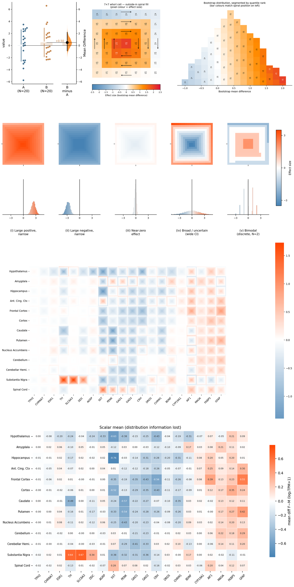

Analysis and figures for a technical paper documenting the design and application of whorlmap.

Whorlmap is a compact heatmap design for high-dimensional comparisons where each cell encodes a full bootstrap/effect-size distribution as a tiny spiral, rather than collapsing uncertainty into a single color. It lets readers scan many treatment–outcome contrasts at once while still seeing direction, magnitude, and uncertainty inside each cell.

{width=500px fig-align="center"}

## Notebooks

| Notebook | Description |
|---|---|
| [Figure 1](nbs/figure1.ipynb) | GTEx sex-difference analysis across 13 brain regions × 20 genes — the main paper figure |
| [Data Pipeline](nbs/helpers/survey.ipynb) | GTEx v8 download, stream-parse, and metadata generation |
| [Cache Builder](nbs/helpers/make_cache.ipynb) | Slice full GTEx to the 20 display genes → committed 514 KB cache |

## Reproduce Figure 1

```sh
git clone https://github.com/sangyu/whorlmap-paper
cd whorlmap-paper/nbs
pip install dabest pandas numpy matplotlib seaborn scipy Pillow svgutils lxml nbconvert ipykernel
jupyter notebook figure1.ipynb
```

`figure1.ipynb` loads the committed expression cache and runs `dabest.combine()` live.
Bootstraps, whorlmap, and all panels are generated fresh. Runtime ~10–15 min.

## Data

Gene expression data are from GTEx v8:

> GTEx Consortium. The GTEx Consortium atlas of genetic regulatory effects across human tissues. *Science* 369, 1318–1330 (2020). <https://doi.org/10.1126/science.aaz1776>
